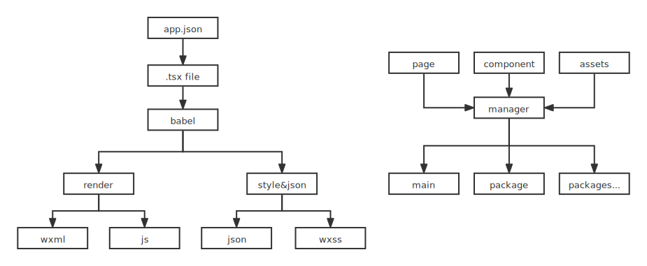

## 简介
<details style="padding-left: 2em;">
  <summary>它是怎么工作的</summary>

  
  <br>
</details>

<details style="padding-left: 2em;">
  <summary>它有什么优势</summary>
  <br>

  - 1.可以直接在模板内运行函数 可以使用事件回调且拥有完整的上下文(原生小程序只能通过事件名称和data-xx传值)
  - 2.使用tsx作为模板 拥有完整的类型校验
  - 3.编译时提取所有模板依赖 使用响应系统自动setData数据
  - 4.自定义组件可以通过导入使用(原生小程序通过json声明)
  - 5.自定义组件支持所有类型的引用值作为属性 (原生小程序只能通过深拷贝传值, 非原始数据)
  - 6.完整的npm包支持 路径别名支持
  - 7.分包&独立分包 分析打包结果并自动分离, 不需要在开发阶段分离资源和组件减少心智负担
  - 8.可以很方便的应用各种设计模式 更好的代码结构支持
  - 9.scss等各种样式扩展格式支持
  - ...
  <br>
</details>

<details style="padding-left: 2em;">
  <summary>什么人适合它</summary>
  <br>

  - 1.使用ts&tsx进行小程序开发的
  - 2.喜欢响应式数据系统的
  - 3.有大型或复杂的项目需求的
  - 4.需要工程化项目的
  - ...
  <br>
</details>

<br>

## 安装
```
$ npm install git+https://github.com/gityoog/march-mp.git --save
```

- 或者 <a href="https://github.com/gityoog/march-mp-example.git">示例项目</a>

``` 
$ git clone https://github.com/gityoog/march-mp-example.git
```

## 构建
<details >
  <summary>webpack 基础配置说明 (version > 5.0)</summary>
  <br>

  ```tsx
  import MPEntryPlugin, 
    { tsxLoader, valueLoader, fixVue3This } from 'march-mp/dist/compiler'

  const config = {
    output: {
      clean: true,
      filename: '[name]',
      globalObject: 'wx'
    },
    context: path.resolve(__dirname, '源码目录'), // 重要, 小程序使用的app.json等文件需要在该目录下
    target: ['web', 'es5'], 
    entry: {
      'app.js': './app.ts' // app.js 入口
    },
    resolve: {
      extensions: [".ts", ".js", ".tsx"]
    },
    module: {
      rules: [
        {
          test: /\.tsx?$/,
          use: [
            {
              loader: 'ts-loader',
              options: {
                getCustomTransformers: () => ({
                  before: [fixVue3This] // 可选, proxy在构造函数内异步使用this时为原始对象, 无法触发响应
                })
                // ...more
              }
            }
          ]
        },
        {
          test: /.tsx$/,
          use: tsxLoader  // 页面和组件tsx编译
        },
        {
          test: /\.scss$/,
          use: [
            {
              loader: valueLoader // 输出wxss需要
            }
            // ...more
          ]
        }
      ]
    },
    // 优化关闭, 插件内部会载入
    optimization: {
      runtimeChunk: false,
      splitChunks: false
    },
    plugins: [
      new MPEntryPlugin() // 分包, 输出, 拷贝等
    ]
    // ...more
  }
  ```
  ```
  ```
</details>
<br>

## 使用
### 1.页面示例

```tsx
import MarchMP from 'march-mp'
import './style.scss' // 导入样式(局部) 将输出至 page.wxss
import TestComponent from '...component'

export default class extends MarchMP.Page {
  // 原小程序json文件 将输出至 page.json
  static $json = { navigationBarTitleText: '测试页面' } 

  onLoad({ url }: Record<string, string>) {
    // 小程序生命周期
  }

  count = 0
  arr: string[] = []
  showA = true
  render(){
    return <view>

      <view class="className">样式类名来源于导入的样式文件</view>

      <TestComponent title="使用组件示例" emitTest={value => {
        console.log('组件回传了', value)
      }}/>

      <view>点击了{this.count}次</view>
      <button bindtap={() => {
        this.count++
        this.showA = !this.showA
      }}>点击</button>

      {this.arr.map(item => <view bindtap={() => {
        console.log(item, '被点击了')
      }}>v-for示例: {item}</view>)}

      {this.showA ? <view>A</view> : <view>三元表达式示例</view>}
      
      {this.showA && <view>逻辑表达式示例</view>}

    </view>
  }
}
```
### 2.组件示例
```tsx
import MarchMP from 'march-mp'

// 其他用法与Page一致
export default class TestComponent extends MarchMP.Component<{
  prop: string // 普通属性声明
  optionalProp?: number // 可选属性声明
  emitTest: (value: string) => void
}> {
  // 声明可选属性的默认值(可选)
  static $propsDefault = {
    optionalProp: 99
  }

  // 属性值变化监控(可选)
  static observers = {
    prop: 'onPropChange'
  }

  // 同微信小程序Component构造器的options(可选)
  static $options = {}

  onPropChange(value: string){
    console.log('prop改变了', value)
  }

  created(){
    console.log('小程序组件声明周期')
  }
  value = 0
  render(){
    return <view>

      <view>组件变量: {this.value}</view>

      <view>上级传入{this.$props.prop}和{this.$props.optionalProp}</view>

      <button bindtap={() => {
        this.$props.emitTest('test')
        this.value ++
      }}>触发属性回调</button>

    </view>
  }
}

```
### 3.资源导入
- 使用图片(需要在webpack里使用url-loader)
  ```tsx
  import TestPic from '.../xxx.png'

  // ...
  <view style={`background: url(${TestPic})`}></view>
  ```
- 原生组件直接导入原生组件路径, 但组件属性需要手动声明, 详见 <a href="https://www.typescriptlang.org/docs/handbook/jsx.html#type-checking">组件类型文档</a>
  ```tsx
  import EcCanvas from '.../ec-canvas'

  // ...
  <EcCanvas id='id' canvas-id='canvas-id' ec={ec}/>
  ```

- 分包使用 
  - 在 `app.json` 中声明分包使用的页面路径, 详见 <a href="https://developers.weixin.qq.com/miniprogram/dev/framework/subpackages/basic.html">使用分包</a>
  - 分包使用的组件资源不需要遵循微信小程序的位置限制, 框架将智能的分离需要的分包内容
- npm包
  - 可直接安装使用npm包

### 4.声明文件
 - 自定义组件无需声明类型 ts可自行推导
 - 原生标签如 `button`,`image` 等需要自行声明类型, 也可导入 <a href="https://github.com/gityoog/march-mp-example/tree/master/src/typings">示例项目内</a> 的声明文件
 - 原生自定义组件需自行声明组件属性文件